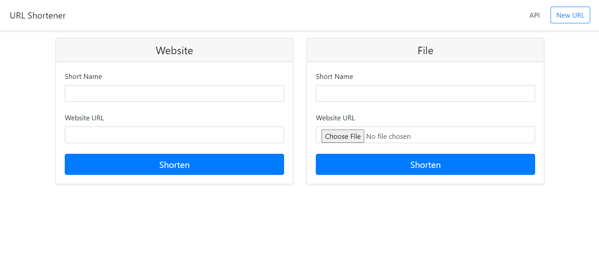
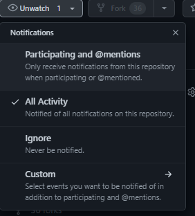
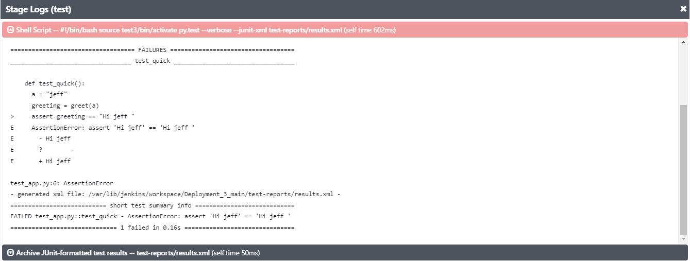
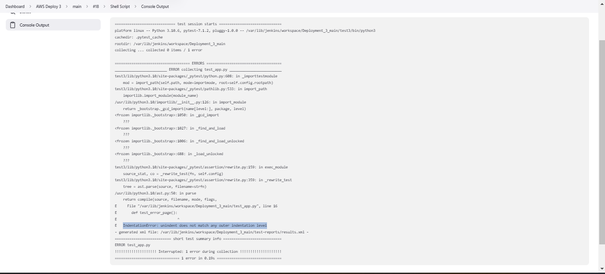

<h1>Deplpyment 3 Documentation</h1>

### Purpose of Deployment
The goal of deployment 3 was:
1) Creating a Jenkins Agent using another EC2.
2) Linking two EC2s in two different VPCs and using one as the manager and the other as a deployment agent.

### Observation
To acomplish this deployment, I went though the following actions:
1) An EC2 which had Jenkins installed already was used.
2) A second EC2 which was created on another VPC was created. It was used as the Jenkins Agent for the deploy stage. Ports 22 and 5000 was opened up for this deployment.
3) On the second EC2, the following packages were installed:
- python3-pip
- nginx
- default-jre
- python3.10-venv
4) Logging into the Jenkins Server, a new agent was created and was given the name of "awsDeploy"
5) After SSH into the second EC2, the `etc\ngnix\site-enabled\default` was edited so that nginx could use port 5000 instead of port 80. Also created a proxy_pass variable in the `location{}` part of the file.
6) The "Pipeline Keep Running Step" plugin was added on the Jenkins Server so that Jenkins wouldn't kill the application after the pipeline went through.
7) The JenkinsFile was modified so that 
- The pipeline could stop Gunicorn if it was running prior to the deploy stage
- The Jenkins could deploy the application on the Jenkins Agent and host the application using nginx.
8) A multi-pipeline was created on the Jenkins Server to build, test and deploy the application. Once the Deployment 3 repository was connected to the Jenkins server, the repository was scanned and the application ran.

### Changes To Pipeline
#### Changing something on the apllication UI
By modifying the files in the `templates/home.html` `templates/your_page.html` `templates/base.html`, I was able to change the UI of the application.

Before:

After:

#### Adding More Tests
To test out some of the functionality of the application I created a few functions in the `test.py` to test the response code for each of the template pages and also to get a response code when inputing a URL that isn't in the application.

1) `test_quick()` this functions uses the `greet()` function in the `application.py` file to test if the expression is the same.

2) `test_home_page()` this function test to see when getting the `/home.html` URL, if it will get a 200 response code.
 
3) `test_URL_Page()` this function test to see when getting the `/your_url` URL, if it will get a 302 response code.

4) `test_error_page()` this function test to see when getting the `/x` or the `/page_not_found` URLs, if it will get a 404 response code.

#### A Way To Be Notified
To notify myself on any changes in the repository, i used the "watch" tab on the Github page.

### Errors while performing deployment
#### Creating test fucnctions
When I was creating the test functions for the `test.py` I ran into a indentation error. I solved this error by backscpacing the def.

